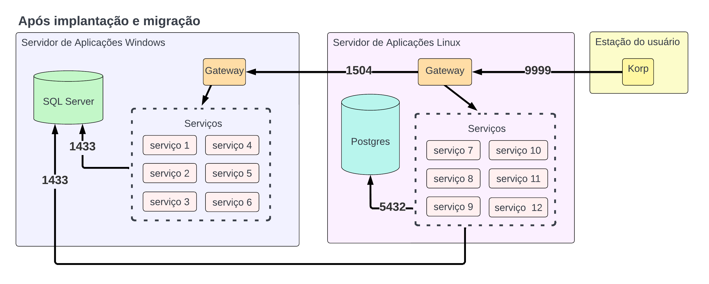

Infraestrutura pós implantação
------------------------------

A Infraestrutura interna é altera após a implantação e migração do servidor Linux. Essa pagina irá explica a estrutura antes e depois.

Nesse servidor LINUX, roda uma versão simplificada do Portal da Korp junto com os aplicativos licenciados a vocês. Esse ambiente é acionado por três DNS e também está em cima de um certificado gerado por uma CA (Autoridade de certificação) criada no próprio servidor. Portanto vocês também terão que disponibilizar esse certificado às estações de trabalho.

.. raw:: html

    <iframe width="560" height="315" src="https://player.vimeo.com/video/776717674?h=df3da82da5" frameborder="0" allowfullscreen></iframe>

O video a cima é complemento dessa documentação, abordando alguns do mesmos tópicos citados nela.

Infraestrutura pré implantação
==============================

Esse tópico aborda o ambiente de clientes que fazem uso do Korp antes da implantação do servidor Linux, apenas com o servidor aplicações Windows.

.. image:: ../../images/infraestrutura_pre_implantacao.png
    :width: 600

A cima esta um diagrama exemplificando o fluxo de comunicação entre o Korp e os os serviços instalados no servidor Windows.

- Configuração do Korp

    No config.json do Korp, é definindo a propriedade ``GatewayIp`` com o IP do servidor Windows, e ``GatewayPort`` com '1504', ou seja, a porta do gateway do servidor Windows.

- Serviços da Korp rodando no servidor Windows

    Entre os serviços Instalados no servidor Windows estão:

        - ``ViasoftKorpLicenseServer`` (Servidor de Licenças)
        - ``ViasoftKorpGateway`` (Gateway)
        - ``ViasoftKorpAuditTrail``
        - ``ViasoftKorpSystemUpdate``
        - ``ViasoftKorpNotification``
        - ``ViasoftKorpStorageServer``
        - ``ViasoftKorpObjectStorage``
        - ``ViasoftKorpConsul``
        - ``ViasoftKorpReportingStimulsoft``

        - ``KorpCadastrosServices``
        - ``KorpDataServerServices``
        - ``KorpFaturamentoEmissaoNotaFiscalLegacyServices``
        - ``KorpFaturamentoEmissaoNotaFiscalServices``
        - ``KorpFinanceiroEmailCobrancaServices``
        - ``KorpLogisticaServices``
        - ``KorpVendasServices``

- Bancos de Dado do SQL Server

    Os únicos bancos utilizados pelo Korp são as bases do cliente, sedo geralmente duas, uma de homologação, e uma de produção.

Infraestrutura após a implantação
=================================

Esse tópico aborda o ambiente do cliente após a implantação e migração do servidor de aplicações Linux.

O diagrama a cima exemplificando o fluxo de comunicação entre o Korp, o servidor de aplicações Linux, e o servidor de Aplicações Windows.

- Configuração do Korp

    No config.json do Korp, é definindo a propriedade ``GatewayIp`` com o IP do servidor Linux, e ``GatewayPort`` com '9999', ou seja, a porta do gateway do servidor Linux.

- Serviços da Korp rodando no servidor Windows

    Entre os serviços Instalados no servidor Windows estão:

        - ``ViasoftKorpLicenseServer`` (Servidor de Licenças)
        - ``ViasoftKorpGateway`` (Gateway)

        - ``KorpCadastrosServices``
        - ``KorpDataServerServices``
        - ``KorpFaturamentoEmissaoNotaFiscalLegacyServices``
        - ``KorpFaturamentoEmissaoNotaFiscalServices``
        - ``KorpFinanceiroEmailCobrancaServices``
        - ``KorpLogisticaServices``
        - ``KorpVendasServices``

- Serviços da Korp rodando no servidor Linux

    Entre os serviços Instalados no servidor Linux estão:

        - ``fabio`` (Gateway)
        - ``Viasoft.Audittrail.Client``
        - ``Viasoft.SystemUpdate``
        - ``Viasoft.Notification``
        - ``Viasoft.ObjectStorage.Client``
        - ``Viasoft.Reporting.Stimulsoft``
        - ``Korp.Legacy.Authentication``
        - ``Viasoft.Email``

.. note::
    Uma parte dos serviços que antes estavam no servidor de aplicações Windows, são agora migrados para o servidor de aplicações Linux.

        De forma geral, todos os serviços ``ViasoftKorp*`` são migrados para o servidor Linux, com exceção de ``ViasoftKorpLicenseServer`` e ``ViasoftKorpGateway``
    
    No Servidor Linux, além dos serviços migrados, também rodam serviços novos, utilizados pelo sistema.

- Bancos de Dado do SQL Server

    Além das bases do cliente, são criados diversos outros bancos, em sua maioria com os prefixos ``Viasoft``.

.. warning::
    **TODOS OS NOVOS BANCOS PRECISAM ESTAR NA ROTINA DE BACKUP**

- Bancos de Postgres

    É criado um gerenciador de banco de dados Postgres, rodando no servidor Linux.

    Nesse Postgres, estão diversos bancos de uso do sistema.

    Devem ser feito backup de todos esses bancos.
    
        Para isso, basta fazer o backup do disco de dados disponibilizado no servidor linux, esse disco está montado em ``/etc/korp``

